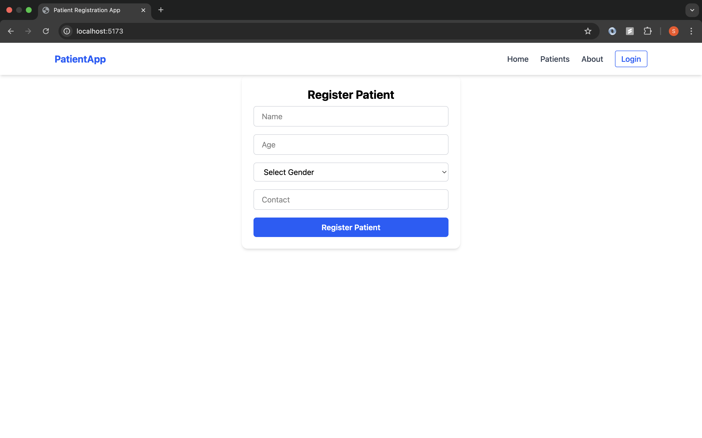
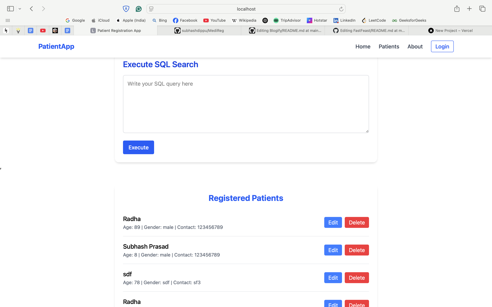
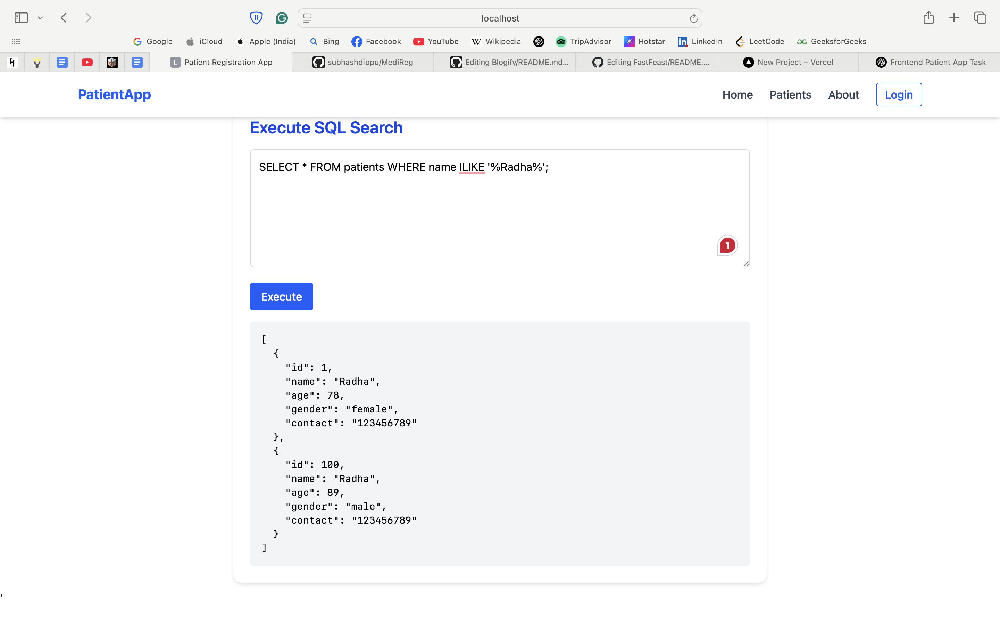

# [MediReg](<[https://travel-saathi.netlify.app/](https://food-app-client-three.vercel.app)>)

## 📌 Introduction

[](https://awesome.re)

MediReg is a modern and responsive web application designed to streamline patient registration for clinics, hospitals, and healthcare providers. Built with React, Vite, and Tailwind CSS, the app simplifies the intake process by providing an intuitive interface for entering, validating, and managing patient information.

## 🚀 View Live Demo


<pre><center><a href=""><b>  </b></a></center></pre>

## Features

📋 Fetch and display all patients

✏️ Edit existing patients

🗑️ Delete patients

🚀 Protected routes

🔄 Real-time UI updates after editing or deleting blogs

## 👨‍💻 Tech Stack Used

-TailwindCSS

-Material UI

-JavaScript

-ReactJS,

-PGlite

-Lucide-react

## 🛠️ Installation Steps

Star and Fork the Repo 🌟 and this will keep us motivated.

1. Clone the repository

```bash
git clone https://github.com/subhashdippu/MediReg.git
```

2. Change the working directory

```bash
cd MediReg
```

3. Install dependencies

```bash
npm install
```

4. Run the app

```bash
npm run start
```

## 📸 Screenshots




